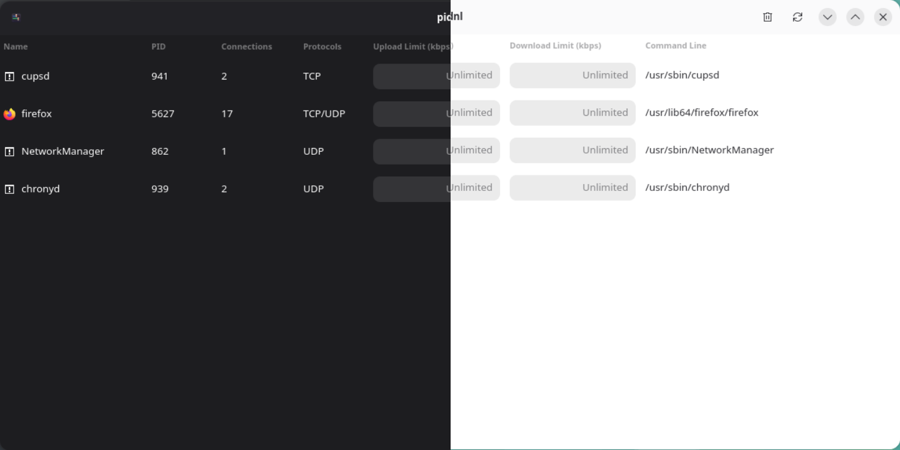

<!-- LOGO -->
<h1>
<p align="center">
  
  <br>pidnl
</h1>
  <p align="center">
    Per-process bandwidth limits for Linux.
    <br />
    A command-line interface and a GTK graphical interface.
    <br />
    <a href="#about">About</a>
    ·
    <a href="#system-requirements">System requirements</a>
    ·
    <a href="#installation">Installation</a>
    ·
    <a href="#usage">Usage</a>
    ·
    <a href="#how-it-works">How it works</a>
  </p>
</p>

## About

`pidnl` lets you cap the upload and download bandwidth of individual Linux
processes, either from the terminal or through a GTK GUI.

It was built as a personal project to learn about eBPF, C, and GTK. It is also
useful for capping processes that are hogging your network when you do not mind
the dropped packets, and as a lightweight tool for some casual chaos
engineering.

## System requirements

pidnl is a Linux-only tool and has a few runtime requirements:

- **cgroup v2** must be mounted and enabled on your system. pidnl creates a
  `pidnl` cgroup and moves the target process into it.
- **eBPF support** is required, specifically the `cgroup/skb` hooks used to
  filter ingress and egress traffic.
- A reasonably recent kernel. The eBPF program uses `bpf_spin_lock`, so
  **Linux 5.1 or newer** is required.
- **Root privileges** are required to attach the eBPF programs and manage
  cgroups. The CLI must be run as root; the GUI will prompt for privileges
  through PolicyKit.

## Installation

Pre-built packages are available on the
[GitHub releases page](https://github.com/ariasmn/pidnl/releases).
There are two packages: `pidnl` (the command-line interface) and `pidnl-gui`
(the graphical interface).

> **Note:** DEB packages are built on Debian 13 and RPM packages are built on
> Fedora 44. Because of that, you may run into compatibility issues when
> installing them on older distributions. Fedora 44 was chosen as the RPM build
> target because in RHEL-based environments `libcgroup` is only available through EPEL
> and didn't feel like I wanted to investigate it.

### Debian 13, Ubuntu 26.04+

Download the `.deb` package and install it with `apt`:

```bash
sudo apt install ./pidnl_*.deb
```

### Fedora 44+

Download the `.rpm` package and install it with `dnf`:

```bash
sudo dnf install ./pidnl-*.rpm
```

### Arch Linux

An Arch package (`.pkg.tar.zst`) is provided, but `libcgroup` is not available
in the official repositories. You will need to install `libcgroup` from the
[AUR](https://aur.archlinux.org/packages/libcgroup) or build it yourself before
installing the pidnl package.

```bash
sudo pacman -U ./pidnl-*.pkg.tar.zst ./pidnl-gui-*.pkg.tar.zst
```

### Building from source

If the pre-built packages do not work on your system, compiling pidnl locally
is usually straightforward.

You will need:

- `clang`
- `bpftool`
- `libbpf`
- `libelf`
- `libcgroup`

For the GUI, you also need:

- `gtk4`
- `libadwaita`

Clone the repository and run the appropriate make target:

```bash
# Command-line interface only
make build

# Graphical interface
make build-gui
```

The `build` and `build-gui` recipes check for the required build dependencies before
starting, so as long as everything is installed the compile should succeed.

## Usage

### Graphical interface

Launch `pidnl-gui` from your application menu or run it from the terminal. The
interface is straightforward: pick a process, set the upload and download
limits, and the limit is applied immediately.

<p align="center">
  
</p>

### Command-line interface

The CLI has three commands:

```bash
# List processes with network connections
sudo pidnl list

# Apply a bandwidth limit to a process (rates are in kbps)
sudo pidnl limit set <pid> <upload_kbps> <download_kbps>

# Remove a bandwidth limit
sudo pidnl limit unset <pid>

# Remove all pidnl rate limits
sudo pidnl clean --yes
```

Use `-1` to leave a direction unlimited. For example, to limit only download
traffic to 2 Mbps:

```bash
sudo pidnl limit set 12345 -1 2000
```

## How it works

`pidnl` is a **traffic policer**, not a traffic shaper. The algorithm it uses
drops packets that exceed the configured rate instead of queueing them. That
means bursts are handled by discarding traffic rather than smoothing it out.

Because of that, `pidnl` is not really suitable for serious production
workloads where smooth quality of service matters. It is great for learning,
experimenting, and controlled chaos, but if you need proper traffic shaping,
look for a tool that queues and schedules packets instead.
